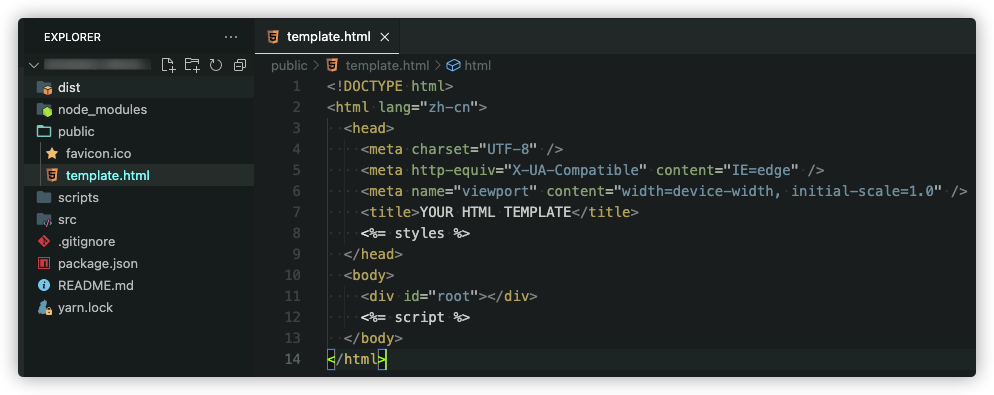

# esbuild-html
[esbuild](https://esbuild.github.io/) plugin for generate pages html.


> Like webpack-html-plugin. generate HTML page for the entry-point javascript.
>

<br>

> #### Install

---

```bash
# npm
npm install esbuild-html -D

# yarn
yarn add esbuild-html -D
```

<br>

> #### Usage

---
### Simple example

esbuild **settings.js**

```javascript
import esbuild from 'esbuild';
import esbuildHTML from 'esbuild-html'

esbuild.build({
  entryPoints: [
    path.resolve(__dirname, 'index.js'),
    path.resolve(__dirname, 'pageA.js'),
    path.resolve(__dirname, 'pageB.js'),
  ],
  plugins: [
    esbuildHTML({
      parameters: {
        valueA: '123', valueB: 'xyz'
      }
    })
  ],
  publicPath: '/www'
});
```

in your **entry point** file.  eg. index.js

define your entry point html template.

```jsx
import '?public/template.html' // << define the 'index.js' entry point
                               // << use "public/template.html" file as template

import ReactDOM from 'react-dom'
import React from 'react'
import { VGroup } from 'v-block.layout'

function App() {
  
  return (
  	<VGroup width="100vw" height="100vh" padding="5px 10px"
            horizontal="center" vertical="center">
    	<h1>ESBuild HTML PLUGIN</h1>
    </VGroup>
  )
}

ReactDOM.render(<App />, document.getElement('root'));
```

at your project root dir.



```
your-esbuild-project
	|- dist
	|- node_modules
	|- src
	|- public
	    |- template.html   << your html template file
	|- package.json
```

**eg. html template file**

```
<%= [parameter name]%>   
// in the settings.js file, esbuildHTML({ parameters:{} });

PS:
<%= styles %> represents the compiled style file with the insertion point inserted here.
<%= script %> represents the compiled jscode file with the insertion point inserted here.

```

**use this template.html**

```html
<!DOCTYPE html>
<html lang="zh-cn">
  <head>
    <meta charset="UTF-8" />
    <meta http-equiv="X-UA-Compatible" content="IE=edge" />
    <meta name="viewport" content="width=device-width, initial-scale=1.0" />
    <title><%= title%></title>
    <%= styles %>
  </head>
  <body>
    <div id="root"></div>
    <%= script %>
  </body>
</html>
```

**import in index.js will output**  

```html
<!DOCTYPE html>
<html lang="zh-cn">
  <head>
    <meta charset="UTF-8" />
    <meta http-equiv="X-UA-Compatible" content="IE=edge" />
    <meta name="viewport" content="width=device-width, initial-scale=1.0" />
    <title>index</title>
    <link rel="stylesheet" href="index.css" />
  </head>
  <body>
    <div id="root"></div>
		<script src="index.js"></script>
  </body>
</html>
```


<h2 align="center">Options</h2>

| Name          | Type     | Default | Description                                            |
| ------------- | -------- | ------- | ------------------------------------------------------ |
| **parameters** | {Object} | {}      | Allows to overwrite the parameters used in the template |

---


> powered by Zonebond of Oneteams studio F2D (F2D is "front-end design and development" team)<br>

> author <zonebond@126.com>

> 知乎 https://www.zhihu.com/people/zonebond/posts

